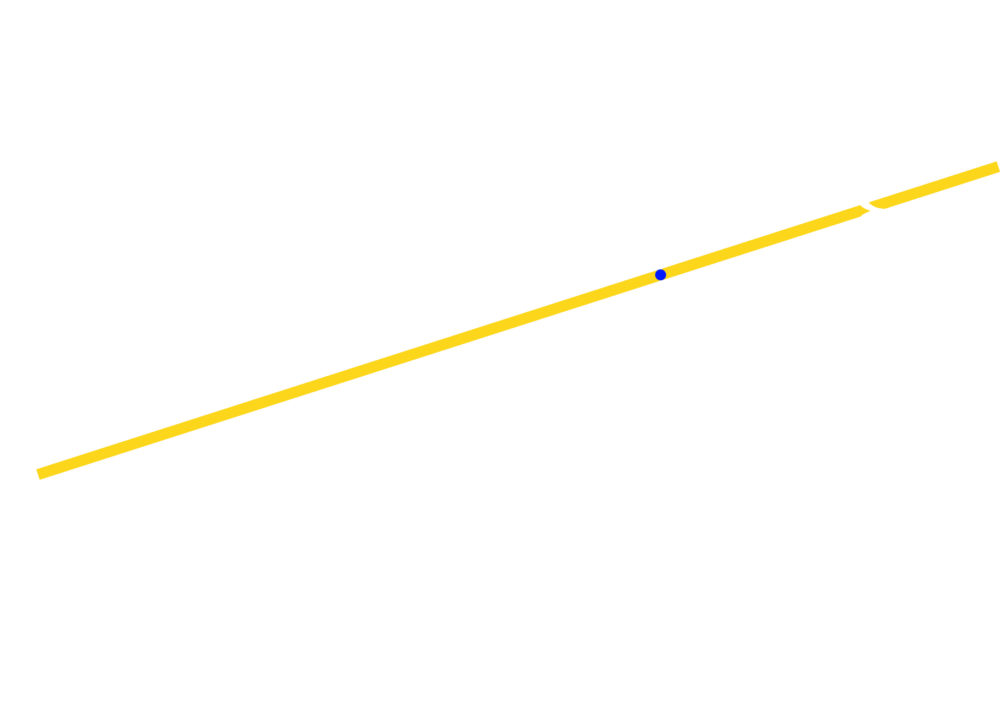

# **Line**

$$
y = mx + b
$$

with $m$ as the slope of the line, $b$ as the $y$ intercept.

If there is a line between these two points $(x_0, y_0), (x_{end}, y_{end})$, then we can determine the slope as -

$$
m = \frac{y_{end} - y_0}{x_{end} - x_0}
$$

and $y$ intercept $b$ as -

$$
b = y_0 − m x_0
$$

 
 

## **The DDA Algorithm**

1. **Get the $dx$ and $dy$ by subtracting $x_0$ from $x_{end}$ & $y_0$ from $y_{end}$**

so,

$$
dx = x_{end} - x_0\hspace{1cm}
dy = y_{end} - y_0
$$

2. **Now find the steps.**

**If** $abs(dx) > abs(dy)$ :

$$
steps = abs(dx)
$$

**Else**

$$
steps = abs(dy)
$$

3. **Find the increment over $x$ and $y$**

$$
x_{inc} = \frac{dx}{steps}\hspace{1cm}
y_{inc} = \frac{dy}{steps}
$$

4. **Iterate $steps$ times and plot $(x, y)$**

$$
x = x + x_{inc}\hspace{1cm}
y = y + y_{inc}
$$

 
 

## **Bresenham Line Algorithm**

- The difference in $x$ is $\Delta x = x_{end} - x_0$.
- The difference in $y$ is $\Delta y = y_{end} - y_0$.

**The slope**, $m = \frac{\Delta y}{\Delta x}$

Let's see all the cases:-

**Case 1:**

For $\hspace{0.3cm}|m| < 1$, $\hspace{0.3cm}x$ changes rapidly, for small changes in $y$.

So,

$$
x_{k+1} = x_k+1
$$

$$
\begin{align*}
y_k &= mx_k + b\\
\text{and,}\hspace{0.3cm}y_{k+1} &= m(x_k + 1) + b\\
&= mx_k + b + m\\
&= y_k + m
\end{align*}
$$

**Case 2:**

For $\hspace{0.3cm}|m| > 1$, $\hspace{0.3cm}y$ changes rapidly, for small changes in $x$.

$$
y_{k+1} = y_k+1
$$

$$
\begin{align*}
y_k &= mx_k + b\\
\text{and,}\hspace{0.3cm}y_{k+1} &= mx_{k + 1} + b\\
y_k + 1 &= mx_{k + 1} + b\\
mx_k + b + 1 &= mx_{k + 1} + b\\
mx_k + 1 &= mx_{k + 1}\\
x_{k + 1} &= x_k + \frac{1}{m}
\end{align*}
$$

**Case 3:**
For $\hspace{0.3cm}|m| = 1$, $\hspace{0.3cm}x$ and $y$ both changes rapidly.

$$
x_{k+1} = x_k+1
$$

$$
y_{k+1} = y_k+1
$$

---

 

**But by the Bresenham's algorithm we 'do not' need a slope(which is a float value) to calculate the next point. Let's evaluate the decision parameter.**

### **Decision Parameter -**

The decision parameter decides whether $y$ should be incremented or not for each $x$, based on the line, if the slope, $\hspace{0.1cm}|m| < 1$. If the slope, $\hspace{0.1cm}|m| > 1$, then it will decide whether to increment the $x$.

**For slope** $\hspace{0.1cm}|m| < 1$:

We are at pixel $(x_k, y_k)$, so the next pixel is either $(x_k+1, y_k)$ or $(x_k+1, y_k+1)$. So, to decide which point to choose, find the distance of points from the line, the point closer will be chosen.

 
 

    

 
 

So, by the line equation $y = mx + b$, the $y$ value at $x_k+1$ will be:

$$
y = m(x_k + 1) + b
$$

Let's find $d_1$ and $d_2$:

$$
\begin{align*}
d_1 &= y - y_k\\
&= m(x_k + 1) + b - y_k\\
\end{align*}
$$

$$
\begin{align*}
d_2 &= y_k+1 - y\\
&= y_k+1 - m(x_k + 1) - b\\
\end{align*}
$$

So, finally -

- If $d_1 - d_2 < 0$, $\hspace{0.2cm}y_k$ will be chosen.
- If $d_1 - d_2 > 0$, $\hspace{0.2cm}y_k+1$ will be chosen.

$$
\begin{align*}
d_1 - d_2 &= [m(x_k + 1) + b - y_k] - [y_k + 1 - m(x_k + 1) - b]\\
&= m(x_k + 1) + b - y_k - y_k - 1 + m(x_k + 1) + b\\
&= 2m(x_k + 1) - 2y_k + 2b - 1 \\
\end{align*}
$$

Now multiplying each side with $\Delta x$ to remove all float values.

$$
\begin{align*}
\Delta x(d_1 - d_2) &= \Delta x\left[2\frac{\Delta y}{\Delta x}(x_k + 1) - 2y_k + 2b - 1\right]\\
&= 2{\Delta y}(x_k + 1) - 2\Delta x y_k + 2\Delta x b - \Delta x\\
&= 2{\Delta y}x_k + 2\Delta y - 2\Delta x y_k + 2\Delta x b - \Delta x\\
&= 2{\Delta y}x_k - 2\Delta x y_k + (2\Delta x b + 2\Delta y - \Delta x)\\
&= 2{\Delta y}x_k - 2\Delta x y_k + c\\
\end{align*}
$$

 

So, the decision parameter at $k\text{th}$ step is:

$$
\begin{align*}
p_k &= \Delta x(d_1 - d_2)\\
&= 2{\Delta y}x_k - 2\Delta x y_k + c
\end{align*}
$$

Now, for the $(k+1)$ step:

$$
\begin{align*}
p_{k+1} &= 2{\Delta y}x_{k+1} - 2\Delta x y_{k+1} + c\\
\text{So, }\hspace{0.3cm} p_{k+1} - p_k &= 2{\Delta y}(x_{k+1} - x_k) - {2\Delta x}(y_{k+1} - y_k)
\end{align*}
$$

However, $x_{k+1} = x_k + 1$, so

$$
p_{k+1} = p_k + 2{\Delta y} - {2\Delta x}(y_{k+1} - y_k)
$$

Where the term $(y_{k+1} - y_k)$ is either $0$ or $1$, depending on the parameter $p_k$. It will be $0$ when the next pixel is plotted at the same $y$-coordinate, and $1$ when the next pixel is plotted at the next $y$-coordinate.

**Finally**, If $p_k < 0$:

$$
\boxed{p_{k+1} = p_k + 2{\Delta y}}
$$

Else:

$$
\boxed{p_{k+1} = p_k + 2{\Delta y} - {2\Delta x}}
$$

 
 
 

**Initial decision parameter:**

The initial decision can be derived from equation $(5)$ as:

$$
p_0 = 2{\Delta y} - \Delta x
$$
